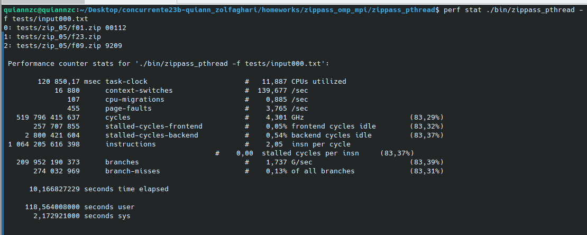
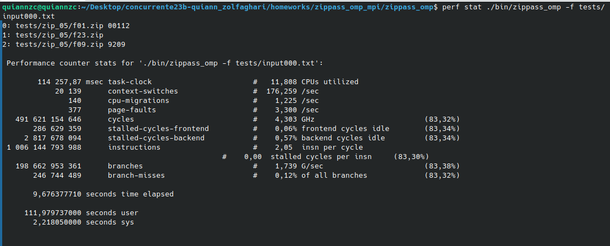
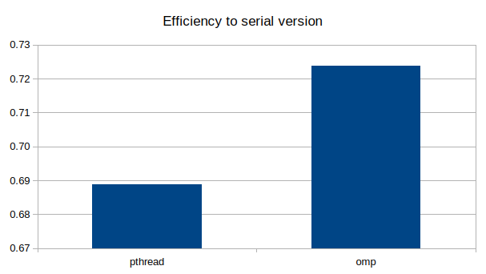
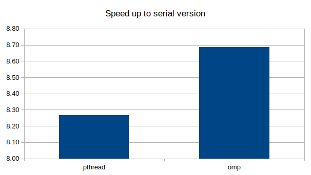

# Comparison Pthreads-OpenMP

### Pthread speed.

### OMP speed.

### Comparison on efficiency and speed up.

The difference seen in the two versions is probably due to a better use of resources by OMP. You can get an improvement up until 5% with the omp version. The mayor difference I could notice in terms of code was the simplification of it, meaning it could be easier to escalate and mantain. This difference is the one that would make me use OMP every time its possible. Also, the time of programming time is significantly reduced, so in general, the use of OMP is a good choice.