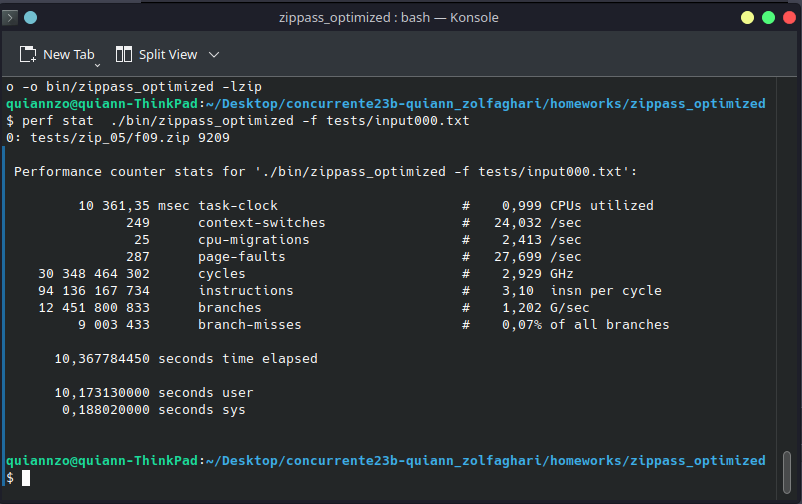
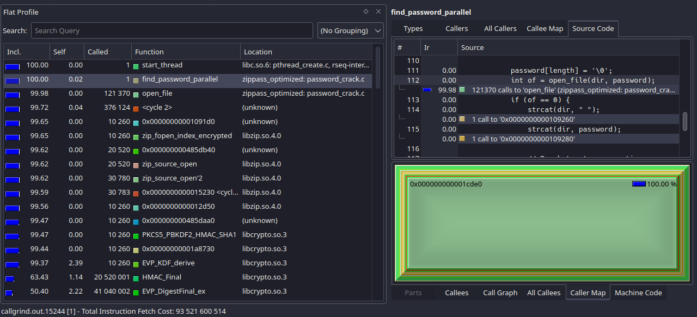
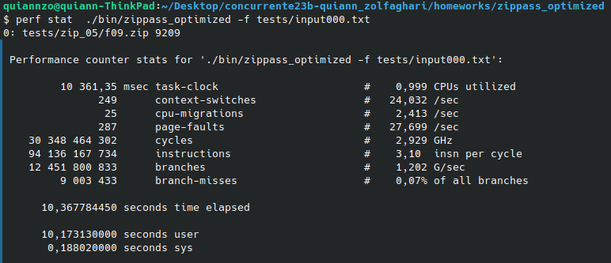
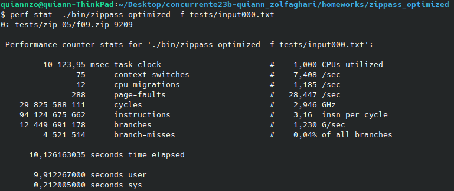

# Optimization 1: Serial

The first optimization is of free choice for the serial version. This document will start with the first optimization made for the algorith and its proof of performance increase.

## Iteration 01.

### Step 1: Testing performance with the non modified version. Small case.

This example demostrates the duration of the program without modifications of any kind.

### Step 2: Profiling.

As you can see, the open_file function is being called several times. This is the part of the code to optimize.

### Step 3-4: Optimization (design).

For optimizing the solution my idea is to cut the number of cycles done by the program by breaking the two for loops when a password is found. While generating passwords is fast, this still improves performance in an interesting way, specially for bigger problems. The design is simple, a break inside the if statement that is entered when a password is successfully found.

### Step 5: Results (speedup and performance) and lessons learned.

This optimization increased the performance of the solution by reducing the number of iterations when a file has a password. The tests were done on small cases, medium and big cases will be tested as well to fill the report sheet. The results were the following:

    Serial solution:                    10,367784450
    serial solution (optimized):         10,1261633035

The performance increased successfully, and in bigger cases it will decrease time on a larger scale. Despite its simplicity I think this is an obvious improvement on code that was already optimized. In terms of load, the open_file function is still the heavier.

