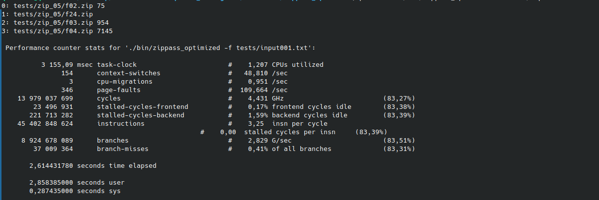
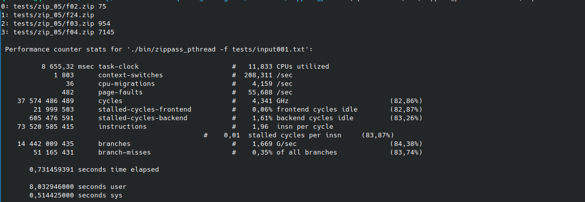
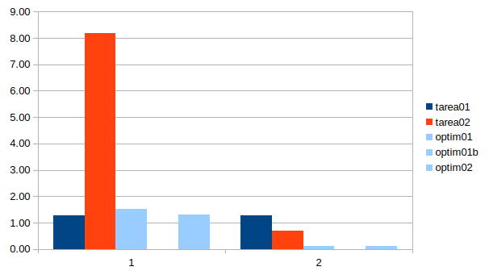
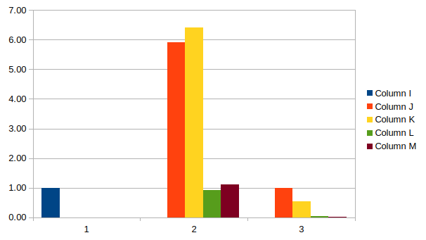

# Optimization 1: Serial

The first optimization is of free choice for the serial version. This document will start with the first optimization made for the algorith and its proof of performance increase.

## Iteration 01.

### Step 1: Testing performance with the non modified version. Small case.

This example demostrates the duration of the program without modifications of any kind.

### Step 2: Profiling.

As you can see, the open_file function is being called several times. This is the part of the code to optimize.

### Step 3-4: Optimization (design).

For optimizing the solution my idea is to cut the number of cycles done by the program by breaking the two for loops when a password is found. While generating passwords is fast, this still improves performance in an interesting way, specially for bigger problems. The design is simple, a break inside the if statement that is entered when a password is successfully found.

### Step 5: Results (speedup and performance) and lessons learned.

This optimization increased the performance of the solution by reducing the number of iterations when a file has a password. The tests were done on small cases, medium and big cases will be tested as well to fill the report sheet. The results were the following:

    Serial solution:                    10,367784450
    serial solution (optimized):         10,1261633035

The performance increased successfully, and in bigger cases it will decrease time on a larger scale. Despite its simplicity I think this is an obvious improvement on code that was already optimized. In terms of load, the open_file function is still the heavier.

# Optimization 2: Pthread.

The second optimization is an extension of the first program, now being parallel. This optimization as mentioned in the instructions is already done, but I will show some results on the performance improvements achieved thanks to multithreading. Detailed data of the optimization and its results can be encountered on the sheet.

Here we have a comparison of performance on the same task of a serial and a parallel version of the program. Note that these mesurements are limited by the machine used which has only 4 threads. The final results written in the sheet are tested with an 8 core machine.

The performance increased by a lot, but the machine limited the potencial of the parallel solution. 

# Optimization 3: Prod-cons pattern.

### Step 1-2: Non modified version performance.

The performance achieved in the second optimization will be the basis of mesurement for the prod-cons mapping that I will do. Profiling wont be done in this case since the logic of the program will be changed.

### Step 3-4: Optimization(design).

The optimization that will be done now is the producer-consumer pattern in exchange of the static mapping used previously. This version will implement it and compare it to its previous version. The way i will be implemented is by using the zip files as the decomposition unit, meaning the paths will be passed to each thread when these are finished with them. 

### Step 5. Implementation and results.

For the implementation, I created a solution that takes the zip file directories as the decomposition unit and sends them into the threads to be processed. The data structure is a queue that has semaphores to control concurrency. The function find_password_parallel is now a void function that recieves a dir and resolves the password for one specific directory. Now, in terms of performance, the pthread version is faster, the possible reasons will be discussed after showing the results. In this case, the tests ran on a 12 processing unit computer, and the input used was input002.

As shown in the results, the prod-cons pattern works worse with the specific decomposition unit than the static mapping working on each directory. The possible causes as I see it are:

    1. The workload is not distributed evenly. Take an input with three directories running on a computer with 12 processing units(this beeing my case). The three directories will be assigned to the first three threads and the rest will not do any work. This didnt happen in the static mapping.

    2. The pattern uses a new data structure. This causes more resources being used.

    3. The use of the pattern. The pattern it self has semaphores, new functions, that could cause the general solution to be slower.

In my opinion, the first factor is the most relevant and can be easily proved.

#### Optimization results

The optimization results were expected, except for undefined behaviour on certain areas. This graph shows the comparison beetween the methods.

#### Concurrency results

The concurrency levels also presented predictable data. The only part that causes certain doubt of the results is the 24 vs 48 threads comparison which handed contrasting results.

